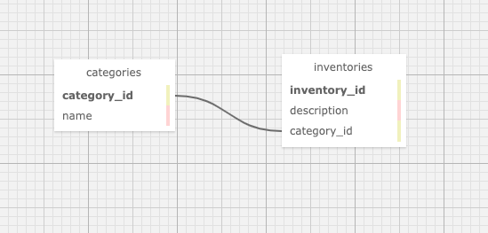

#  Inventory - Disaster Preparedness

#### By Hyung Jin Kim, Noah Atkinson, Vera Weikel 

#### This is a project to build Basic Web Application using ASP .Net, EF Core, MVC.

## Technologies Used

* .Net 6 SDK
* C#
* EFCore
* ASP.Net MVC
* Razor

## Goals/Objectives

This project shows how to connect an ASP.NET Core MVC project to a MySQL database using [Entity Framework Core](https://learn.microsoft.com/en-us/ef/core/).

There are multiple branches in this repo that are described more below.


## Description

Make a website where users can inventory their collections. This collection could be anything from records to rocks to board games, depending on your interest. The application should have full create and read functionality.

Further Exploration
If you complete the projects above with time to spare, tackle these additional features:

Create a Search() method in either the Inventory or Animal Shelter application. It should take the name of the animal or item as an argument and return any animals or items that match.
Let users choose what properties to search by. For instance, this could be type or age of animal in the animal shelter application or date acquired or keyword in the inventory application.
Continue on to tonight's homework and add update and delete functionality to your application.

## Database Architecture
  <!--  -->



## How To Run This Project

### Install Tools

Install the tools that are introduced in [this series of lessons on LearnHowToProgram.com](https://www.learnhowtoprogram.com/c-and-net/getting-started-with-c).

### Set up the Databases

Follow the instructions in the LearnHowToProgram.com lesson ["Creating a Test Database: Exporting and Importing Databases with MySQL Workbench"](https://www.learnhowtoprogram.com/lessons/creating-a-test-database-exporting-and-importing-databases-with-mysql-workbench) to use the `inventorypreparedness_with_ef_core_dump.sql` file located at the top level of this repo to create a new database in MySQL Workbench with the name `inventory_preparedness_with_ef_core`.

### Set Up and Run Project

1. Clone this repo.
2. Open the terminal and navigate to this project's production directory called "InventoryPreparedness".
3. Within the production directory "InventoryPreparedness", create a new file called `appsettings.json`.
4. Within `appsettings.json`, put in the following code, replacing the `uid` and `pwd` values with your own username and password for MySQL. For the LearnHowToProgram.com lessons, we always assume the `uid` is `root` and the `pwd` is `epicodus`.

```json
{
  "ConnectionStrings": {
      "DefaultConnection": "Server=localhost;Port=3306;database=inventory_preparedness_with_ef_core;uid=[YOUR-MYSQL-LOGIN-NAME];pwd=[YOUR-MYSQL-PASSWORD];"
  }
}
```

5. Within the production directory "InventoryPreparedness", run `dotnet watch run` in the command line to start the project in development mode with a watcher.
4. Open the browser to _https://localhost:5001_. If you cannot access localhost:5001 it is likely because you have not configured a .NET developer security certificate for HTTPS. To learn about this, review this lesson: [Redirecting to HTTPS and Issuing a Security Certificate](https://www.learnhowtoprogram.com/lessons/redirecting-to-https-and-issuing-a-security-certificate).


## Available Branches

**1_ef_core_setup**: This is the default branch with the starter code for the To Do List project as an ASP.NET Core MVC web application that is configured to use Entity Framework Core to communicate with a MySQL database. This branch includes the code we added after working through the following lessons:

- https://www.learnhowtoprogram.com/c-and-net/database-basics/introducing-entity-framework-core
- https://www.learnhowtoprogram.com/c-and-net/database-basics/configuration-for-entity-framework-core


**2_create_read_and_details_with_html_helpers**: This branch includes the code we added after working through the following lessons:

- https://www.learnhowtoprogram.com/c-and-net/database-basics/read-with-ef-core
- https://www.learnhowtoprogram.com/c-and-net/database-basics/create-with-ef-core
- https://www.learnhowtoprogram.com/c-and-net/database-basics/html-helper-methods-lambda-expressions-and-string-interpolation
- https://www.learnhowtoprogram.com/c-and-net/database-basics/showing-item-details-with-ef-core
- https://www.learnhowtoprogram.com/c-and-net/database-basics/further-exploration-with-testing

**3_update_and_delete**: This branch includes the code we added after working through the following lessons:

- https://www.learnhowtoprogram.com/c-and-net/database-basics/update-with-ef-core
- https://www.learnhowtoprogram.com/c-and-net/database-basics/delete-with-ef-core

**4_one_to_many_relationship**: This branch includes the code we added after working through the following lessons:

- https://www.learnhowtoprogram.com/c-and-net/database-basics/establishing-a-one-to-many-relationship-with-navigation-properties
- https://www.learnhowtoprogram.com/c-and-net/database-basics/using-viewbag
- https://www.learnhowtoprogram.com/c-and-net/database-basics/create-and-update-with-a-one-to-many-relationship


## Known Bugs

* None

## License

MIT License

Permission is hereby granted, free of charge, to any person obtaining a copy
of this software and associated documentation files (the "Software"), to deal
in the Software without restriction, including without limitation the rights
to use, copy, modify, merge, publish, distribute, sublicense, and/or sell
copies of the Software, and to permit persons to whom the Software is
furnished to do so, subject to the following conditions:

The above copyright notice and this permission notice shall be included in all
copies or substantial portions of the Software.

THE SOFTWARE IS PROVIDED "AS IS", WITHOUT WARRANTY OF ANY KIND, EXPRESS OR
IMPLIED, INCLUDING BUT NOT LIMITED TO THE WARRANTIES OF MERCHANTABILITY,
FITNESS FOR A PARTICULAR PURPOSE AND NONINFRINGEMENT. IN NO EVENT SHALL THE
AUTHORS OR COPYRIGHT HOLDERS BE LIABLE FOR ANY CLAIM, DAMAGES OR OTHER
LIABILITY, WHETHER IN AN ACTION OF CONTRACT, TORT OR OTHERWISE, ARISING FROM,
OUT OF OR IN CONNECTION WITH THE SOFTWARE OR THE USE OR OTHER DEALINGS IN THE
SOFTWARE.

Copyright (c) 2023  Hyung Jin Kim, Noah Atkinson, Vera Weikel 
